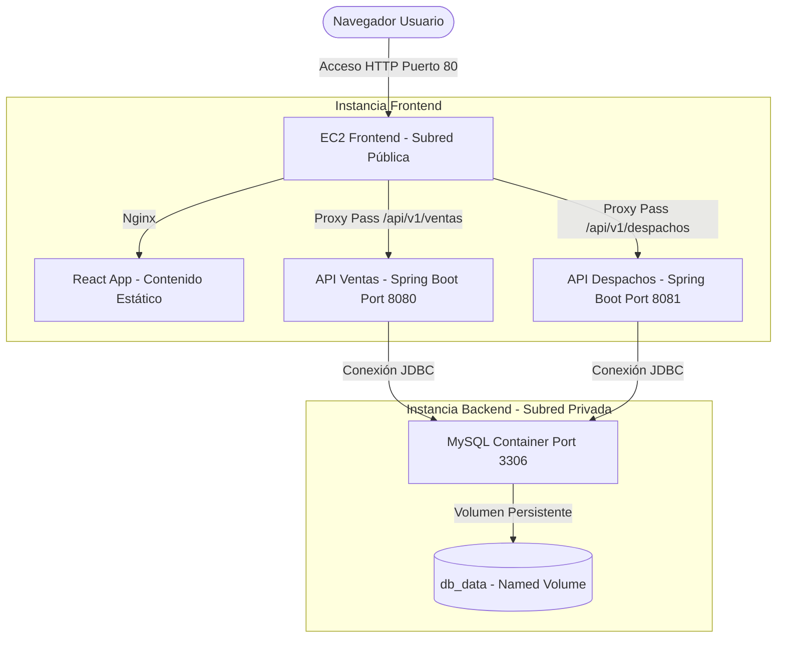

# Innovatech Chile - Sistema de Gestión de Ventas y Despachos

Este repositorio contiene la solución técnica de contenedorización y automatización del despliegue (CI/CD) para la plataforma de Innovatech Chile, desarrollada para la Evaluación Parcial 2 de la asignatura Introducción a Herramientas DevOps.

La solución integra tres microservicios en una arquitectura distribuida en la nube de AWS (instancias EC2 separadas para Frontend y Backend/Base de datos) mediante el uso de Docker, Docker Compose y GitHub Actions.

---

## Arquitectura del Sistema

El despliegue está estructurado mediante subredes en AWS para garantizar la comunicación y seguridad de los componentes:



1. **Instancia Frontend (Subred Pública)**:
   - **Aplicación React**: Compilada y servida mediante un servidor web Nginx expuesto en el puerto 80.
   - **Proxy Inverso (Nginx)**: Redirige las peticiones `/api/v1/ventas/*` y `/api/v1/despachos/*` hacia la dirección IP privada de la instancia Backend, evitando la exposición directa de las APIs a redes públicas.

2. **Instancia Backend (Subred Privada)**:
   - **API Ventas (Spring Boot)**: Servicio encargado del negocio de ventas en el puerto 8080.
   - **API Despachos (Spring Boot)**: Servicio encargado del negocio de despachos en el puerto 8081.
   - **Base de Datos (MySQL 8.0)**: Base de datos relacional expuesta internamente en el puerto 3306 de la red Docker.

---

## Estructura del Proyecto

```text
Eval 2 - Innovatech/
├── .github/
│   └── workflows/
│       ├── deploy-backend.yml      # Pipeline CI/CD del Backend
│       └── deploy-frontend.yml     # Pipeline CI/CD del Frontend
├── back-Despachos_SpringBoot/      # Microservicio de Despachos (Spring Boot)
│   └── Springboot-API-REST-DESPACHO/
│       ├── Dockerfile              # Dockerfile Multi-stage del backend Despachos
│       ├── .dockerignore
│       └── src/...
├── back-Ventas_SpringBoot/         # Microservicio de Ventas (Spring Boot)
│   └── Springboot-API-REST/
│       ├── Dockerfile              # Dockerfile Multi-stage del backend Ventas
│       ├── .dockerignore
│       └── src/...
├── front_despacho/                 # Aplicación Frontend (React + Vite)
│   ├── nginx/
│   │   └── default.conf.template   # Configuración de Nginx para proxy dinámico
│   ├── Dockerfile                  # Dockerfile Multi-stage del frontend
│   ├── .dockerignore
│   ├── vite.config.js              # Configuración de proxy de desarrollo
│   └── src/...
└── docker-compose.yml              # Orquestador local para testing y desarrollo
```

---

## Contenedores y Buenas Prácticas

### 1. Construcción Multi-Stage
Se estructuraron los Dockerfiles en múltiples etapas para optimizar el peso y seguridad de las imágenes de producción:
- **Frontend**: La etapa de construcción utiliza Node.js 20 para compilar la aplicación. La etapa de ejecución copia únicamente los archivos estáticos resultantes (/dist) a una imagen limpia de Nginx, reduciendo el tamaño a unos 25 MB.
- **Backends**: La primera etapa utiliza Maven para resolver dependencias y compilar el archivo JAR ejecutable. La segunda etapa copia solo el JAR compilado a una imagen JRE Alpine de Eclipse Temurin, eliminando dependencias de construcción del entorno de producción.

### 2. Principio de Menor Privilegio (Usuario No-Root)
En los Dockerfiles de los microservicios Spring Boot, se configuró la ejecución bajo un usuario del sistema sin privilegios administrativos (appuser) y su grupo correspondiente (appgroup). Esto mitiga riesgos de seguridad asociados al escalado de privilegios.

### 3. Independencia de Entornos en el Frontend
La aplicación utiliza rutas relativas (`/api/v1/...`) para los llamados HTTP. 
- En el entorno de desarrollo, Vite redirige las llamadas a los puertos locales.
- En el entorno de producción, Nginx procesa las variables de entorno (`BACKEND_VENTAS_IP` y `BACKEND_DESPACHOS_IP`) mediante la plantilla `default.conf.template` durante el arranque. Esto permite el despliegue del contenedor en cualquier infraestructura sin requerir una recompilación de la aplicación.

---

## Persistencia de Datos

Para la base de datos MySQL, se definió un volumen nombrado (Named Volume) en la configuración de Docker Compose:
* **Volumen**: `db_data` en la ruta `/var/lib/mysql`.

### Justificación Técnica:
1. **Permisos de Escritura**: MySQL requiere permisos específicos del sistema de archivos interno de Linux. El uso de volúmenes nombrados permite que Docker gestione automáticamente estos permisos, evitando errores de inicialización.
2. **Rendimiento**: El almacenamiento administrado de Docker garantiza un rendimiento de lectura/escritura óptimo, independiente de la estructura física de carpetas del host.
3. **Mantenibilidad**: Los datos de la base de datos se conservan íntegros tras paradas, reinicios o eliminaciones de los contenedores (`docker compose down`).

---

## Ejecución Local

Para levantar el stack completo en desarrollo local:

1. Abrir una terminal en la carpeta raíz del proyecto (`Eval 2 - Innovatech`).
2. Ejecutar la compilación y levantamiento:
   ```bash
   docker compose up --build -d
   ```
3. Puertos de acceso:
   - **Frontend (React)**: [http://localhost](http://localhost) (Puerto 80).
   - **API Ventas**: [http://localhost:8080/swagger-ui/index.html](http://localhost:8080/swagger-ui/index.html).
   - **API Despachos**: [http://localhost:8081/swagger-ui/index.html](http://localhost:8081/swagger-ui/index.html).

---

## Pipeline de Integración y Despliegue Continuo (CI/CD)

Los workflows de GitHub Actions están programados para ejecutarse al realizar un push en la rama `deploy` o de forma manual mediante `workflow_dispatch`.

### Funcionamiento de los Pipelines:
1. **Fase de Construcción y Publicación**: Automatiza la descarga de código, inicio de sesión en Docker Hub, construcción de imágenes con tags numerados (`1.0.${GITHUB_RUN_NUMBER}`) y la subida al registro.
2. **Fase de Despliegue**: Se conecta con AWS mediante credenciales temporales y utiliza AWS Systems Manager (SSM) para enviar de forma segura un comando shell a la instancia EC2.
3. **Bootstrap Automatizado**: El script ejecutado en la máquina EC2:
   - Instala Docker y Docker Compose si no están instalados.
   - Crea el directorio de trabajo de la aplicación.
   - Genera dinámicamente el archivo `docker-compose.yml` inyectando los secretos de entorno y credenciales de Docker Hub.
   - Ejecuta `docker compose pull` y `docker compose up -d` para desplegar la nueva versión.

### Secretos requeridos en el repositorio de GitHub:
- `DOCKERHUB_USERNAME`: Usuario de Docker Hub.
- `DOCKERHUB_TOKEN`: Access Token de Docker Hub.
- `AWS_ACCESS_KEY_ID`: ID de clave de acceso de AWS.
- `AWS_SECRET_ACCESS_KEY`: Clave de acceso secreta de AWS.
- `AWS_SESSION_TOKEN`: Token de sesión temporal de AWS.
- `BACKEND_INSTANCE_ID`: ID de la instancia de Backend EC2.
- `FRONTEND_INSTANCE_ID`: ID de la instancia de Frontend EC2.
- `BACKEND_PRIVATE_IP`: Dirección IP privada de la instancia Backend.
